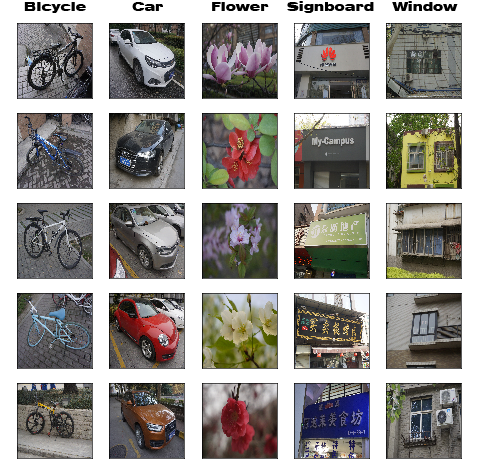
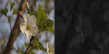
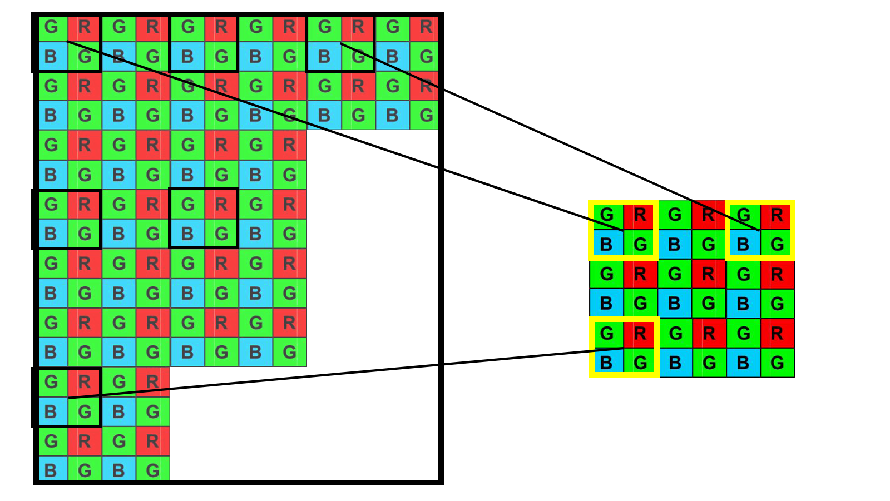
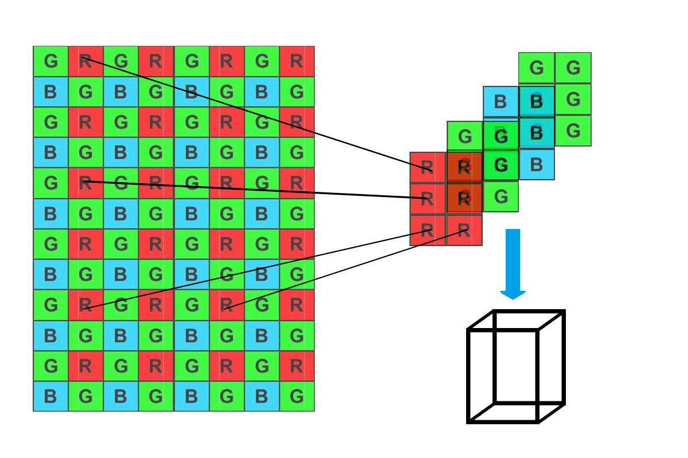

The RawDataset was collected and labeled by Creammmmm of Xidian University.

# RawDataset
The RawDataset consists of 5000 raw data images in 5 classes, with 1000 images per class. There are 4000 training images and 1000 testing images. The device used in the dataset shooting is Sony α6000. The camera store images in both ARW & JPG formats at the same time when you take a photo.

Both of the training dataset and the testing dataset are sorted by category. Here are the classes in the dataset. We choose five images from each class in random. 

This dataset contains images in two formats, here is the comparison. The image in ARW format is converted to JPG format and the brightness is adjusted because the ARW format is not suitable for direct viewing. You will observe the mosaic effect in the raw format.

Most images are mutually exclusive as they should be. But there are part of images contain other category, especially window and signboard. They are too close to shoot one category alone. After these images having been filtered, the situation was much better, but forgive that these are still a few images that contain other categories. 

## Subsample    
The size of the original image is 6000 by 4000 pixels, it takes so much space that we have to upload the images after downsampling. Here are a few different ways to downsample. 

### JPG down
Downsampling the original three-channel JPG image from 6000 by 4000 to 224 by 224. Just downsampling.

### RAW mosaic

The original raw image is a single-channel grayscale image with mosaic. Each small square with a size of 2 by 2 contains one Red channel, one Green channel, one Blue channel and another Green channel. When we downsample the raw image by one small square after another, we will get a smaller mosaic image which has a similar structure to the original raw image.

### RAW RGBG

Similar to the previous method, we downsample the raw image by one small square after another, the difference is that each small square with a size of 2 by 2 is downsampled into a four-channel pixel. So we can't store the downsampled data into any image format, but only in a numpy matrix.

## Download
If you're going to use this dataset, please send me an email to let me know. 

Here is my email address: dhgao@xidian.edu.cn

Most downsampling methods have two versions except Raw-RGBG. You could download one you like.

### Version

#### Original ARW & JPG
- (still uploading)

#### JPG down
- [Jpg-224-224-3-image](https://drive.google.com/open?id=1ZxGMjCLGnpXwm1ErS6YEiWJCHjPFH_Np) (474MB)
- [Jpg-224-224-3-npy](https://drive.google.com/open?id=1yvryCDbzAUCbHQkwgP-N8M8zhmPKp96b) (708MB)

#### RAW mosaic
- [Raw-mosaic-224-224-1-image](https://drive.google.com/open?id=12TmWM1I3JjmDX5MP2lWIyrqOJ1Ac460h) (302MB)
- [Raw-mosaic-224-224-1-npy](https://drive.google.com/open?id=1uhFyHrvPLWIALECGcsZ8loyoLCZL0obb) (325MB)

#### RAW mosaic large
- [Raw-mosaic-448-448-1-image](https://drive.google.com/open?id=1Z18FKWjPJvNC3cAwMqKHQFTxosDBsW7p) (1.11GB)
- [Raw-mosaic-448-448-1-npy](https://drive.google.com/open?id=1hHj2dfOb9KEihWm_9O50L0mMzIujFmye) (1.18GB)

#### RAW-RGBG
- [Raw-RGBG-224-224-4-npy](https://drive.google.com/open?id=1pjRAjM8aXSHbYqCSYF5hERnHgbfPXhbH) (1.30GB)

## Dataset layout

### Image Version
In the Image Version, here are two floders in the first level. They are training set & testing set. In both of them, there are five folders, each of which stores images of each categories and is named by it. The images are in .tiff format with a bit depth of 16.

Structure: train & test ==> classes ==> images

### Numpy Matrix Version
In the Numpy Matrix Version, there are a total of four files with the .npy suffix. 

#### x_train:
 x_train is a four-dimensional matrix of the training data. The shape of the matrix is ( Number of images, Width of image, Height of image, channel)

#### y_train:
y_train is the label of the x
_train. They are arranged in order.

#### x_test:
x_test is a four-dimensional matrix of the testing data. The shape of the matrix is ( Number of images, Width of image, Height of image, channel)

#### y_test:
y_test is the label of the x
_test. They are arranged in order.

## Copyright Notice
**The copyright of this dataset belongs to the OIBP(Optoelectronic Imaging and Brain-Inspired Perception Laborotary), Institute of Artificial Intelligence, Xidian University**